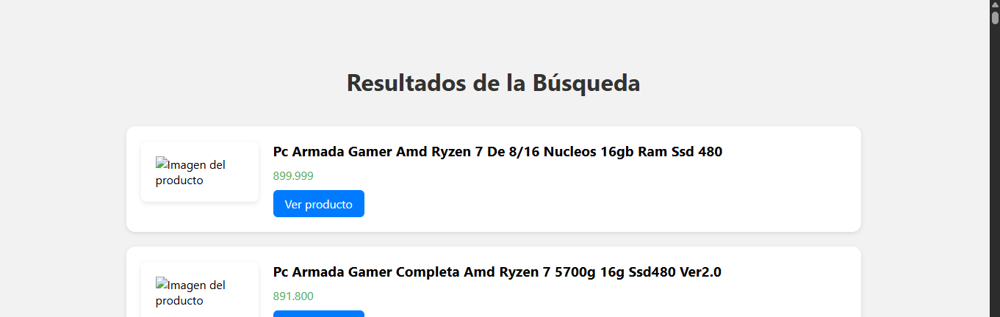

# 🛍️ Web Scraper de Productos - MercadoLibre Argentina

Este es un proyecto web desarrollado en Django que permite buscar productos en [MercadoLibre Argentina](https://listado.mercadolibre.com.ar/) y visualizar los resultados, incluyendo el nombre del producto, precio, enlace al producto e imagen.
Todo este proyecto se basa en la famosa pagina de [CamelCamelCamel](https://es.camelcamelcamel.com/)

## 🚀 Funcionalidades

- 🔎 Búsqueda de productos por palabra clave.
- 📄 Scraping de múltiples páginas de resultados.
- 💰 Muestra de nombre, precio, imagen y link directo al producto.
- 🎨 Interfaz estilizada con HTML y CSS.
- 🔄 Pantalla de carga mientras se obtienen los datos (en proceso).

## 🛠️ Tecnologías utilizadas

- Python 3.13+
- Django 5.1.3
- BeautifulSoup4
- Requests
- HTML5 + CSS3

## 📷 Captura de pantalla

### Así es la pantalla principal de busqueda ⤵️
 

### Y aqui un ejemplo de busqueda ⤵️
 

## ⚙️ Correcciones
- Hacer imagen visible
- Poder ver todas las paginas de Mercado Libre
- Ver los precios historicos de un mismo producto
- Hacer una pagina principal con valores más baratos historicamente en un carrousel

## PROYECTO
[MERCADO SCRAPPER.docx](https://github.com/user-attachments/files/20734988/MERCADO.SCRAPPER.docx)
